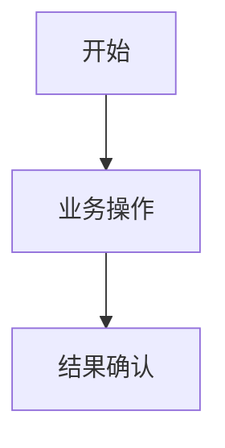

# 业务需求说明书 BRS

## 1. 业务目标

- 目标：
- 业务价值：
- 成功指标：

## 2. 业务范围

- 本次包含：
- 本次不包含：
- 受影响团队/角色：

## 3. 业务流程

## 4. 业务角色

| 角色 | 职责 | 权限边界 |
| --- | --- | --- |
|  |  |  |

## 5. 业务规则

| 编号 | 规则 | 说明 |
| --- | --- | --- |
| BR-001 |  |  |

## 6. 异常与边界

| 场景 | 处理方式 | 责任人 |
| --- | --- | --- |
|  |  |  |

## 7. 验收标准

- 验收项 1：
- 验收项 2：

## 8. 评审记录

- 评审日期：
- 参与人：
- 结论：
- 遗留问题：
