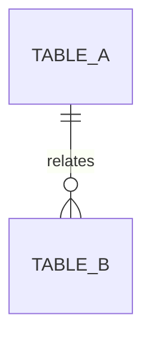

# 数据库设计说明

## 1. 变更概述

- 关联需求：
- 变更类型：新增表 / 修改表 / 数据迁移 / 索引调整
- 是否影响生产数据：

## 2. ER 关系



## 3. 表结构

| 表名 | 用途 | 主键 | 重要索引 |
| --- | --- | --- | --- |
|  |  |  |  |

## 4. 字段字典

| 表 | 字段 | 类型 | 可空 | 默认值 | 说明 |
| --- | --- | --- | --- | --- | --- |
|  |  |  |  |  |  |

## 5. 脚本与执行顺序

```sql
-- DDL/DML scripts
```

## 6. 回滚方案

- 回滚脚本：
- 数据备份：
- 验证方式：
