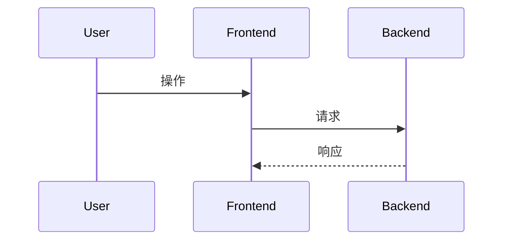

# 详细设计说明书 LLD

## 1. 模块信息

- 模块名称：
- 关联 SRS：
- 关联 HLD：
- 负责人：

## 2. 内部流程

## 3. 关键函数/类

| 名称 | 职责 | 输入 | 输出 | 异常 |
| --- | --- | --- | --- | --- |
|  |  |  |  |  |

## 4. 状态流转

| 状态 | 进入条件 | 退出条件 | 用户可见结果 |
| --- | --- | --- | --- |
|  |  |  |  |

## 5. 边界与异常

- 输入校验：
- 文件/路径安全：
- 错误脱敏：
- 兼容字段：
- 回滚策略：

## 6. 测试点

- 单元测试：
- 契约测试：
- 集成测试：
- 人工验证：
